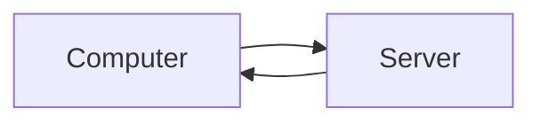

# Chai-Backend

## Set-up Required:

1. Node Installation: https://nodejs.org/en
2. Initializing an Application from node package manager: this will generate package.json file

```
$npm init (or)
$npm init -y (will make default selections automitically)
```

3. Run Js file ex: index.js

```
package.json
"start": "node index.js"

Run command
$npm run start
or
$node index.js
```
4. Install Express: https://expressjs.com/

```
$ npm install express
```
5. DOTENV: https://www.npmjs.com/package/dotenv
to store sensitive information such as database name, password etc.
```
npm install dotenv 
```

npm start will run "node index.js" command which we added it in package.json

## Basics:

1. / :means home route
2. main functionality of express is to listen communication between computer and server(routes like /, /login)



